# Estructura y Lógica de la Base de Datos — Nexus Ops RTB

> **Estado:** vigente para Sprint 1+
> **Fuente original:** `Documentación de Bases de Datos — RTB` (17 bases exportadas de Notion)
> **Archivo de modelos:** `backend/app/models/ops_models.py`
> **Última revisión:** 2026-04-20

Este documento describe cómo se implementa en **PostgreSQL 16 + SQLAlchemy 2.0** el sistema operativo que originalmente vivía en Notion. Contiene:

1. Principios de diseño y convenciones.
2. Mapa de las 17 bases de Notion → tablas SQLAlchemy.
3. Diagrama ERD (Mermaid).
4. Catálogo de fórmulas/rollups y su estrategia de cálculo (columnas generadas, triggers o servicios).
5. Especificación campo por campo de cada tabla.
6. Consideraciones para migración y para los flujos n8n / CSV.

---

## 1. Principios de diseño

- **Idioma de tablas en español, columnas en inglés.** Las tablas se llaman `productos`, `clientes`, `cotizaciones`, … para coincidir con el dominio que usa RTB; las columnas siguen `snake_case` en inglés por convención del backend FastAPI.
- **UUID como PK.** Todas las entidades de dominio usan `UUID` (`PGUUID(as_uuid=True)`). Las tablas de staging/CSV mantienen `Integer` auto-incremental.
- **`external_id`** se conserva para correlacionar la migración de IDs de Notion y las cargas n8n.
- **Denormalización de rollups.** Los campos que en Notion son "rollup" o "formula" se guardan como columnas propias para permitir consultas rápidas en los dashboards. La sincronización se hace con una de estas estrategias:
  - `GENERATED ALWAYS AS (...) STORED` cuando la fórmula depende únicamente del propio registro (ej. `iva = subtotal * 0.16`).
  - **Triggers de Postgres** (`scripts/bootstrap_triggers.sql`) para fórmulas que requieren agregar de otra tabla (ej. `productos.real_outflow`, `inventario.real_qty`).
  - **Servicios Python** (`app/services/rollups.py`) para cálculos de alto costo o que dependen de ventanas temporales (ej. demanda 180 días, clasificaciones ABC).
- **Trazabilidad de usuarios.** Los campos `created_by_user_id`, `last_edited_by_user_id`, `approved_by_user_id`, etc. apuntan a `users.id` con `ON DELETE SET NULL` para no perder la auditoría si se desactiva un usuario.
- **Borrado suave implícito.** Las relaciones externas no usan `CASCADE`; se usa `SET NULL` para conservar el histórico. Solo `QuoteItem → Quote` y los tokens de refresh tienen `CASCADE`.
- **Multi-select.** Los campos multi-selección de Notion se guardan en columnas `JSON` (ej. `purchase_invoice.payment_methods`, `customer_order.invoice_status_multi`).

### Decisiones específicas tomadas para esta base

| Tema | Decisión | Motivo |
|------|----------|--------|
| Directorio único Notion | **Separado** en `clientes` y `proveedores` | Evita columnas nullable masivas y simplifica los índices de facturación |
| Categorías / Marcas | **Tablas propias** (`categorias`, `marcas`) | El `% de ganancia` y `% de subida` alimentan el precio del producto |
| Campos documentados | **Incluir todos** los que aparecen en la PDF | Mantener paridad completa con Notion |
| Estrategia de rollups | **Columnas calculadas + triggers** | Dashboards rápidos sin romper normalización |

---

## 2. Mapa de bases Notion → tablas SQL

| # | Base en Notion | Tabla SQL | Clase SQLAlchemy | Observaciones |
|---|----------------|-----------|------------------|---------------|
| — | Categorías (nuevo) | `categorias` | `Category` | Alimenta `% ganancia` de productos |
| — | Marcas (nuevo) | `marcas` | `Brand` | Alimenta `% subida` de productos |
| 1 | Catálogo de Productos | `productos` | `Product` | |
| 2 | Proveedores y Productos | `proveedor_productos` | `SupplierProduct` | N:N producto↔proveedor con precio |
| 3 | Entradas de Mercancía | `entradas_mercancia` | `GoodsReceipt` | Fórmula `delivery_percent` |
| 4 | Gestión de inventario | `inventario` | `InventoryItem` | Semáforos y ABC |
| 5 | Directorio de Ubicaciones — Clientes | `clientes` | `Customer` | |
| 5 | Directorio de Ubicaciones — Proveedores | `proveedores` | `Supplier` | |
| 6 | Facturas compras | `facturas_compras` | `PurchaseInvoice` | |
| 7 | Cotizaciones a Clientes | `cotizaciones` | `Quote` | |
| 7b | Detalle Cotizaciones a Clientes (data-source-47) | `cotizacion_items` | `QuoteItem` | Fuente de demanda real |
| 8 | Pedidos de Clientes | `pedidos_clientes` | `CustomerOrder` | |
| 9 | Pedidos Incompletos | `pedidos_incompletos` | `IncompleteOrder` | |
| 10 | Reporte de Ventas | `ventas` | `Sale` | Dashboard de ventas |
| 11 | Cotizaciones Canceladas | `cotizaciones_canceladas` | `CancelledQuote` | |
| 12 | Solicitudes de Material | `solicitudes_material` | `MaterialRequest` | |
| 13 | No Conformes | `no_conformes` | `NonConformity` | Fórmula `Ajuste Inventario` |
| 14 | Bitácora de Movimientos | `movimientos_inventario` | `InventoryMovement` | |
| 15 | Crecimiento de Inventario | `crecimiento_inventario` | `InventoryGrowth` | Snapshots mensuales |
| 16 | Verificador de fechas pedidos | `verificador_fechas_pedidos` | `OrderDateVerification` | Log de cambios de fecha |
| 17 | Gastos Operativos RTB | `gastos_operativos` | `OperatingExpense` | |
| — | Pedidos a Proveedor (auxiliar) | `pedidos_proveedor` | `SupplierOrder` | |
| — | Staging (n8n) | `staging.csv_files`, `staging.csv_rows`, `staging.csv_row_errors` | `CsvFile`, `CsvRow`, `CsvRowError` | Esquema `staging` |
| — | Auditoría de ingesta | `csv_import_runs` | `CsvImportRun` | |

---

## 3. Diagrama ERD

```mermaid
erDiagram
    USERS ||--o{ CLIENTES : "created_by"
    USERS ||--o{ PROVEEDORES : "created_by"
    USERS ||--o{ COTIZACIONES : "approved_by"
    USERS ||--o{ PEDIDOS_CLIENTES : "fulfillment_responsible"
    USERS ||--o{ PEDIDOS_INCOMPLETOS : "responsible"
    USERS ||--o{ MOVIMIENTOS_INVENTARIO : "created_by"
    USERS ||--o{ FACTURAS_COMPRAS : "created_by"
    USERS ||--o{ GASTOS_OPERATIVOS : "created_by"
    USERS ||--o{ SOLICITUDES_MATERIAL : "created_by"
    USERS ||--o{ ENTRADAS_MERCANCIA : "created_by"
    USERS ||--o{ VERIFICADOR_FECHAS_PEDIDOS : "triggered_by"

    CATEGORIAS ||--o{ PRODUCTOS : "category_ref"
    MARCAS ||--o{ PRODUCTOS : "brand_ref"

    PRODUCTOS ||--o{ COTIZACION_ITEMS : "product"
    PRODUCTOS ||--o{ INVENTARIO : "product"
    PRODUCTOS ||--o{ MOVIMIENTOS_INVENTARIO : "product"
    PRODUCTOS ||--o{ NO_CONFORMES : "product"
    PRODUCTOS ||--o{ SOLICITUDES_MATERIAL : "product"
    PRODUCTOS ||--o{ ENTRADAS_MERCANCIA : "product"
    PRODUCTOS ||--o{ PROVEEDOR_PRODUCTOS : "product"
    PRODUCTOS ||--o{ PEDIDOS_INCOMPLETOS : "product"

    PROVEEDORES ||--o{ PROVEEDOR_PRODUCTOS : "supplier"
    PROVEEDORES ||--o{ PEDIDOS_PROVEEDOR : "supplier"
    PROVEEDORES ||--o{ FACTURAS_COMPRAS : "supplier"
    PROVEEDORES ||--o{ GASTOS_OPERATIVOS : "supplier"
    PROVEEDORES ||--o{ SOLICITUDES_MATERIAL : "supplier"
    PROVEEDORES ||--o{ ENTRADAS_MERCANCIA : "supplier"

    CLIENTES ||--o{ COTIZACIONES : "customer"
    CLIENTES ||--o{ PEDIDOS_CLIENTES : "customer"
    CLIENTES ||--o{ VENTAS : "customer"
    CLIENTES ||--o{ VERIFICADOR_FECHAS_PEDIDOS : "customer"

    COTIZACIONES ||--o{ COTIZACION_ITEMS : "items"
    COTIZACIONES ||--o{ VENTAS : "sale"
    COTIZACIONES ||--o{ PEDIDOS_CLIENTES : "order"
    COTIZACIONES ||--o{ COTIZACIONES_CANCELADAS : "cancellation"
    COTIZACIONES ||--o{ PEDIDOS_INCOMPLETOS : "quote"
    COTIZACIONES ||--o{ VERIFICADOR_FECHAS_PEDIDOS : "quote"

    COTIZACION_ITEMS ||--o{ MOVIMIENTOS_INVENTARIO : "quote_item_ref"

    PEDIDOS_CLIENTES ||--o{ PEDIDOS_INCOMPLETOS : "customer_order"
    PEDIDOS_CLIENTES ||--o{ NO_CONFORMES : "customer_order"
    PEDIDOS_CLIENTES ||--o{ VERIFICADOR_FECHAS_PEDIDOS : "customer_order"

    FACTURAS_COMPRAS ||--o{ ENTRADAS_MERCANCIA : "purchase_invoice"
    FACTURAS_COMPRAS ||--o{ NO_CONFORMES : "purchase_invoice"
    FACTURAS_COMPRAS ||--o{ PEDIDOS_PROVEEDOR : "purchase_invoice"

    INVENTARIO ||--o{ NO_CONFORMES : "inventory_item"

    ENTRADAS_MERCANCIA ||--o{ MOVIMIENTOS_INVENTARIO : "goods_receipt"
    NO_CONFORMES ||--o{ MOVIMIENTOS_INVENTARIO : "nonconformity"
```



> El diagrama resume las relaciones más representativas; consulta `ops_models.py` para ver todas las FK (`created_by_user_id`, `last_edited_by_user_id`, etc.).

---

## 4. Fórmulas, rollups y triggers

Todas las fórmulas originales de Notion se migraron siguiendo una de estas tres categorías. El archivo `scripts/bootstrap_triggers.sql` centraliza la definición en Postgres; los servicios Python viven en `backend/app/services/rollups/`.

### 4.1 Columnas generadas (single-row)

| Tabla | Columna | Expresión |
|-------|---------|-----------|
| `facturas_compras` | `iva` | `(subtotal + shipping_cost) * 0.16` |
| `facturas_compras` | `total` | `subtotal + shipping_cost + iva - invoice_discount - shipping_insurance_discount` |
| `gastos_operativos` | `iva` | `subtotal * 0.16` |
| `gastos_operativos` | `total` | `subtotal + iva` |
| `ventas` | `total` | `subtotal * 1.16` |
| `ventas` | `gross_margin` | `subtotal - purchase_cost` |
| `ventas` | `margin_percent` | `gross_margin / NULLIF(subtotal, 0)` |
| `ventas` | `diff_vs_po` | `subtotal - subtotal_in_po` |
| `ventas` | `year_month` | `to_char(sold_on, 'TMMonth YYYY')` |
| `ventas` | `quadrimester` | `CASE …` (Ene-Abr / May-Ago / Sep-Dic) |
| `cotizaciones` | `subtotal_with_shipping` | `(subtotal + shipping_cost) * (1 - discount)` |
| `cotizaciones` | `monthly_interest` | `CASE WHEN credit THEN 0.0175 ELSE 0 END` |
| `cotizaciones` | `total_interest` | `monthly_interest * months` |
| `cotizaciones` | `total` | `credit ? subtotal_with_shipping * (1 + total_interest) * 1.16 : subtotal_with_shipping * 1.16` |
| `cotizacion_items` | `subtotal` | `qty_requested * unit_cost_sale` |
| `cotizacion_items` | `purchase_subtotal` | `qty_requested * unit_cost_purchase` |
| `cotizacion_items` | `qty_missing` | `qty_requested - qty_packed` |
| `solicitudes_material` | `total_amount` | `unit_cost * qty_requested` |
| `solicitudes_material` | `qty_requested_converted` | `is_packaged ? qty_requested / package_size : qty_requested` |
| `entradas_mercancia` | `total_cost` | `unit_cost * qty_requested` |
| `entradas_mercancia` | `delivery_percent` | `qty_arrived / NULLIF(qty_requested, 0)` |
| `entradas_mercancia` | `qty_requested_converted` | `is_packaged ? qty_requested * package_size : qty_requested` |
| `no_conformes` | `inventory_adjustment` | ver fórmula `Ajuste Inventario` (§4.3) |

### 4.2 Triggers (agregados entre tablas)

| Trigger | Origen | Destino (columna) | Cálculo |
|---------|--------|-------------------|---------|
| `trg_productos_rollups` | `cotizacion_items` | `productos.real_outflow` | `SUM(qty_packed)` donde status aprobado |
| | | `productos.theoretical_outflow` | `SUM(qty_requested)` |
| | | `productos.total_accumulated_sales` | `SUM(subtotal)` |
| | | `productos.demand_90_days` | `SUM(qty_requested)` últimos 90 días |
| | | `productos.demand_180_days` | `SUM(qty_requested)` últimos 180 días |
| | | `productos.committed_demand` | `SUM(qty_missing)` con cotización activa |
| | | `productos.last_outbound_date` | `MAX(last_updated_on)` de items empacados |
| `trg_productos_precio` | `proveedor_productos` | `productos.unit_price_base` | `AVG(price)` |
| | `productos.brand_ref` | `productos.unit_price` | `(1 + markup_percent) * unit_price_base` |
| `trg_inventario_qty` | `movimientos_inventario` | `inventario.inbound_real` | `SUM(qty_in)` donde `movement_type ∈ {Entrada, Devolución}` |
| | | `inventario.outbound_real` | `SUM(qty_out)` donde `movement_type ∈ {Salida}` |
| | `no_conformes` | `inventario.nonconformity_adjustment` | `SUM(inventory_adjustment)` |
| | → `inventario.real_qty` | `inbound_real - outbound_real + nonconformity_adjustment` |
| | → `inventario.theoretical_qty` | `inbound_theoretical - outbound_theoretical` |
| | → `inventario.stock_diff` | `real_qty - theoretical_qty` |
| | → `inventario.stock_total_cost` | `real_qty * unit_cost` |
| `trg_inventario_semaforos` | `inventario` | `status_real` | `CASE WHEN real_qty < 0 THEN 'Sin stock' WHEN real_qty = 0 THEN '0' ELSE 'En stock' END` |
| | | `stock_alert` | `CASE WHEN min_stock IS NULL THEN 'Sin definir' WHEN real_qty < min_stock THEN 'Bajo mínimo' ELSE 'OK' END` |
| | | `days_without_movement` | `CURRENT_DATE - last_outbound_on` |
| | | `purchase_block` | `real_qty > 0 AND days_without_movement > 180` |
| `trg_clientes_rollups` | `ventas` | `clientes.annual_purchase` | `SUM(total)` últimos 365 días |
| | | `clientes.last_purchase_date` | `MAX(sold_on)` |
| | `pedidos_clientes` | `clientes.avg_payment_days` | `AVG(payment_time_days)` |
| `trg_cotizaciones_packed` | `cotizacion_items` | `cotizaciones.missing_products` | `SUM(qty_missing)` |
| | | `cotizaciones.packed_percent` | `SUM(qty_packed) / SUM(qty_requested) * 100` |
| | | `cotizaciones.order_status` | `CASE 0→Pendiente, 0<x<100→Parcial, 100→Preparado` |
| `trg_pedidos_tiempos` | `pedidos_clientes` | `delivery_time_days` | `delivered_on - shipped_on` |
| | | `payment_time_days` | `paid_on - invoiced_on` |
| | | `preparation_time_days` | `shipped_on - ordered_on` |
| `trg_pedidos_incompletos` | `pedidos_incompletos` | `aging_days` | `CURRENT_DATE - created_at::date` |

### 4.3 Servicios Python (`backend/app/services/rollups/`)

Se reservan para cálculos que no son triviales en SQL puro o que necesitan reglas de negocio con datos externos:

- **Clasificación ABC** (`inventario.abc_classification`) — recorre productos calculando el percentil de ventas acumuladas y clasifica A (≥50k), B (10k-49k), C (<10k).
- **Clasificación Antigüedad** (`aging_classification`) — derivada de `days_without_movement` (Activo ≤30, Rotación baja ≤90, Dormido ≤180, Inactivo ≤365, Obsoleto >365).
- **Crecimiento de Inventario** (`crecimiento_inventario`) — snapshots mensuales; crea un registro al primero de cada mes con el valor total y el número de productos sin movimiento.
- **Proyecciones** — el servicio `forecast.py` usa `demand_180_days` y las series de `ventas` para estimar ventas, margen y % empacado.
- **Fórmula `Ajuste Inventario`** (no_conformes):
  ```
  if quantity IS NULL              → NULL
  elif action_taken = 'Reingreso a inventario' → +quantity
  elif action_taken = 'Ajuste':
      if adjustment_type = 'Entrada' → +quantity
      if adjustment_type = 'Salida'  → -quantity
  else                              → -quantity
  ```

---

## 5. Especificación de tablas

A continuación el detalle de cada tabla con los campos principales. Los campos técnicos (`id`, `created_at`, `updated_at`) se omiten por brevedad — están presentes en todas las tablas de dominio.

### 5.1 `categorias` — `Category` *(nuevo)*

| Campo | Tipo | Descripción |
|-------|------|-------------|
| `name` | `String(120)` unique | Nombre de la categoría |
| `description` | `Text` | Descripción opcional |
| `profit_margin_percent` | `Numeric(6,4)` | `% de ganancia` que se usa para calcular el precio |
| `is_active` | `Boolean` | |

### 5.2 `marcas` — `Brand` *(nuevo)*

| Campo | Tipo | Descripción |
|-------|------|-------------|
| `name` | `String(120)` unique | |
| `description` | `Text` | |
| `markup_percent` | `Numeric(6,4)` | `% de subida` para `productos.unit_price` |
| `is_active` | `Boolean` | |

### 5.3 `clientes` / `proveedores` — `Customer` / `Supplier`

Tablas simétricas con los mismos campos (se separan para mantener indexes y reglas de negocio independientes).

| Campo | Tipo | Notas |
|-------|------|-------|
| `external_id` | `String(80)` | ID de Notion |
| `name` | `String(255)` | |
| `short_code` | `String(40)` | Siglas / ID corto |
| `legal_name` | `String(255)` | Razón social |
| `rfc` | `String(20)` | |
| `main_contact`, `phone`, `email`, `website`, `address` | — | |
| `category` | `String(40)` | Foraneo / Local |
| `status` | `String(40)` | Prospecto / Activo / Inactivo |
| `annual_purchase` | `Numeric(14,2)` | Rollup (trigger) |
| `last_purchase_date` | `Date` | Rollup |
| `avg_payment_days` | `Numeric(10,2)` | TPP rollup |
| `notes` | `Text` | |
| `created_by_user_id` | `UUID FK users.id` | |

### 5.4 `productos` — `Product`

| Campo | Tipo | Notas |
|-------|------|-------|
| `sku`, `internal_code`, `sat_code` | `String(255)` unique / indexed | |
| `name`, `description`, `status`, `sale_type`, `package_size` | — | |
| `brand_id` → `marcas.id`, `category_id` → `categorias.id` | FK `SET NULL` | |
| `brand`, `category` | `String` | Caché denormalizado |
| `warehouse_location` | `String(120)` | Ubicación en Almacén |
| `image_url`, `datasheet_url` | `String(500)` | |
| `is_internal` | `Boolean` | |
| `unit_price`, `unit_price_base` | `Numeric(14,4)` | Precio final y precio base (avg proveedores) |
| `purchase_cost_parts`, `purchase_cost_ariba` | | Costos separados |
| `theoretical_outflow`, `real_outflow`, `total_accumulated_sales`, `demand_90_days`, `demand_180_days`, `last_outbound_date`, `committed_demand` | Rollups | Desde `cotizacion_items` |

### 5.5 `proveedor_productos` — `SupplierProduct`

Tabla puente con restricción única `(product_id, supplier_id, supplier_type)`:

- `product_id`, `product_sku`, `product_label`
- `supplier_id`, `external_supplier_id`, `supplier_name`
- `price` (MXN)
- `supplier_type` — Principal / Alterno
- `is_available` — Disponibilidad
- `material_request_id`, `goods_receipt_id` — enlaces opcionales al ciclo de compra

### 5.6 `cotizaciones` / `cotizacion_items` — `Quote` / `QuoteItem`

Cotizaciones:

- Identificadores: `name`, `po_pr`, `file_url`
- Estados: `status`, `quote_status`, `order_status`, `ariba_status`
- Cliente: `customer_id`, `external_customer_id`, `customer_code`
- Fechas: `created_on`, `approved_on`, `followed_up_on`, `packed_on`
- Montos: `discount`, `shipping_cost`, `credit`, `months`, `subtotal`, `purchase_subtotal`, + campos calculados (`subtotal_with_shipping`, `monthly_interest`, `total_interest`, `total`)
- Derivados: `missing_products`, `packed_percent`, `approval_days`
- Trazabilidad: `payment_time`, `payment_type`, `delivery_role`, `approved_by_user_id`

Cotización ítems (`cotizacion_items`) — columna vertebral de la demanda:

- `quote_id` (CASCADE), `line_external_id`, `status`
- `product_id`, `external_product_id`, `sku`, `category`
- `qty_requested`, `qty_packed`, `qty_missing`
- `unit_cost_purchase`, `unit_cost_sale`, `subtotal`, `purchase_subtotal`
- Rollups: `accumulated_sales`, `last_90_days`, `last_180_days`
- `quote_status`, `external_customer_id`, `last_updated_on`

### 5.7 `cotizaciones_canceladas` — `CancelledQuote`

`quote_number`, `cancelled_on`, `reason` (texto libre), `cancellation_reason` (select), `evidence_url`, `quote_id`, `external_customer_id`.

### 5.8 `ventas` — `Sale`

Vista materializada desde cotizaciones aprobadas: `name`, `notes`, `sold_on`, `customer_id`, `status`, `subtotal`, `total`, `purchase_cost`, `subtotal_in_po`, `gross_margin`, `margin_percent`, `diff_vs_po`, `packed_percent`, `year_month`, `quadrimester`, `quote_id`.

### 5.9 `inventario` — `InventoryItem`

Tabla central de stock con **35+ campos**. Agrupados:

- Identificación: `product_id`, `external_product_id`, `internal_code`, `notes`
- Cantidades (trigger): `real_qty`, `theoretical_qty`, `stock_diff`, `inbound_real/theoretical`, `outbound_real/theoretical`, `nonconformity_adjustment`
- Costos: `unit_cost`, `stock_total_cost`
- Configuración: `min_stock`, `physical_diff`
- Flags: `reviewed`, `arranged`, `identified`, `processed`, `has_physical_diff`
- Semáforos: `status_real`, `stock_alert`, `purchase_block`, `days_without_movement`, `movement_traffic_light`, `aging_classification`, `rotation_classification`, `abc_classification`, `suggested_action`, `purchase_exception_reason`
- Fechas/historial: `last_inbound_on`, `last_outbound_on`, `demand_history`, `total_accumulated_sales`, `raw_payload`, `updated_on`

### 5.10 `movimientos_inventario` — `InventoryMovement`

Log unificado: `movement_number`, `product_id`, `movement_type` (Entrada · Salida · Ajuste · Devolución · Merma · No conforme), `qty_in`, `qty_out`, `qty_nonconformity`, `moved_on`, `origin`, `destination`, `observations`, FKs a `entradas_mercancia`, `cotizacion_items`, `no_conformes`, `users`.

### 5.11 `crecimiento_inventario` — `InventoryGrowth`

Snapshots de `Inventario` / `Productos sin movimiento` por fecha (`registered_on`, `amount`, `growth_type`, `name`).

### 5.12 `no_conformes` — `NonConformity`

`folio`, `detected_on`, `quantity`, `reason` (Dañado / Incompleto / Equivocado / Devuelto / Fuera de especificación / Caduco), `action_taken` (Devolución a proveedor / Ajuste / Cuarentena / Desecho / Reingreso a inventario), `adjustment_type` (Entrada / Salida), `inventory_adjustment` (computed), `status`, `product_id`, `inventory_item_id`, `purchase_invoice_id`, `customer_order_id`, `detected_by`, `photo_evidence_url`, `observations`, `temporary_physical_location`.

### 5.13 `solicitudes_material` — `MaterialRequest`

`product_id`, `product_sku`, `qty_requested`, `qty_requested_converted`, `is_packaged`, `notes`, `requested_on`, `status` (Pendiente → Revisado → Procesado), `supplier_id`, `unit_cost`, `total_amount`, `package_size`, `days_without_movement`, `blocked_by_dormant_inventory`, `purchase_exception_reason`, `demand_history`, `last_valid_outbound_on`. Rollups del proveedor cacheados: `supplier_contact_name/email/phone/address`. Auditoría: `created_by_user_id`, `last_edited_by_user_id`.

### 5.14 `entradas_mercancia` — `GoodsReceipt`

`entry_number`, `qty_requested`, `qty_arrived`, `qty_requested_converted`, `is_packaged`, `physical_validation`, `validated_by`, `supplier_id`, `internal_code`, `product_id`, `unit_cost`, `total_cost`, `received_on`, `delivery_percent`, `paid_on`, `payment_status`, `payment_type`, `purchase_invoice_id`, `tdp`, `package_size`, auditoría de usuario.

### 5.15 `pedidos_proveedor` — `SupplierOrder`

Órdenes de compra a proveedor (`order_folio`, `order_status`, `pickup_status`, fechas de envío/recolección, `products_requested` JSON, montos, `is_confirmed`, `sent_by_email`, `is_printed`, `followup_responsibles`, `purchase_invoice_id`).

### 5.16 `facturas_compras` — `PurchaseInvoice`

`quote_number`, `invoice_number`, `comments`, `purchase_type`, `cfdi_usage` (G01/G03), `supplier_id`, `supplier_rfc`, `received_on`, `invoice_on`, `paid_on`, `shipping_cost`, `shipping_insurance`, `invoice_discount`, `shipping_insurance_discount`, `payment_type` (legacy), `payment_methods` (JSON multi-select), `order_status`, `payment_status`, `invoice_status`, `subtotal`, `iva` (computed), `total` (computed), `delivered_percent`, `related_goods_receipts` (JSON), `review_responsible`, `task_assigned`, `invoice_file_url`, `material_evidence_url`, `related_nonconformities`, `created_by_user_id`.

### 5.17 `gastos_operativos` — `OperatingExpense`

`concept`, `invoice_folio`, `account_card_number`, `notes`, `subtotal`, `iva` (computed), `total` (computed), `spent_on`, `is_deductible`, `category` (Renta/Local · Servicios · Transporte/Combustible · Mantenimiento · Honorarios · Alimentación/Viáticos · Publicidad/Marketing · Comisiones Bancarias · Otros · Software), `payment_method` (Efectivo · Tarjeta · Transferencia · OXXO), `status`, `file_url`, `responsible`, `supplier_id`, `supplier_name`, `supplier_rfc`, `created_by_user_id`.

### 5.18 `pedidos_clientes` — `CustomerOrder`

`name`, `customer_id`, `customer_code`, números (`invoice_number`, `delivery_note_number`, `payment_complement_number`), `received_by`, `notes`, archivos (`invoice_file_url`, `delivery_note_file_url`), pago (`payment_type`, `payment_status`, `invoice_status`, `invoice_status_multi` JSON, `invoice_state`), `order_status`, `has_missing_items`, `delivery_type`, fechas principales (`ordered_on`, `validated_on`, `approved_on`, `associated_on`, `shipped_on`, `delivered_on`, `invoiced_on`, `paid_on`) y secundarias (`secondary_*_on`), `fulfillment_responsible(_user_id)`, `quote_id`, totales, tiempos calculados (`delivery_time_days`, `payment_time_days`, `preparation_time_days`), `packed_percent`, `raw_payload`.

### 5.19 `pedidos_incompletos` — `IncompleteOrder`

`name`, `additional_notes`, `priority` (Alta · Media · Baja), `reason`, `status`, `estimated_resolution_on`, `aging_days`, `responsible`, `responsible_user_id`, `customer_order_id`, `quote_id`, `product_id`, `customer_final_id`, `missing_products`.

### 5.20 `verificador_fechas_pedidos` — `OrderDateVerification`

Log automático: `customer_order_id`, `order_name`, `event_type` (Envío · Entrega · Aprobación · Asociación · Validación · Facturación · Pago · Asociación Secundaria), `event_date`, `event_datetime`, `triggered_by`, `triggered_by_user_id`, `customer_id`, `quote_id`, `order_link`.

### 5.21 Infraestructura CSV / n8n

- `csv_import_runs` — auditoría por corrida: dataset, filename, sha256, contadores, start/finish, status, mensaje de error.
- `staging.csv_files`, `staging.csv_rows`, `staging.csv_row_errors` — buffer de ingesta. Se truncan al aprobar la corrida.

---

## 6. Consideraciones de migración

1. **Alembic.** Generar una migración `0002_rtb_structure.py` con `alembic revision --autogenerate`. Revisar las columnas `GENERATED ALWAYS AS` — pueden requerir edición manual porque Alembic no las expresa automáticamente.
2. **Orden de carga inicial** (n8n y seed):
   1. `users` (seed manual)
   2. `categorias`, `marcas`
   3. `clientes`, `proveedores`
   4. `productos`
   5. `proveedor_productos`
   6. `cotizaciones` → `cotizacion_items`
   7. `facturas_compras`, `pedidos_proveedor`
   8. `entradas_mercancia`
   9. `inventario`
   10. `movimientos_inventario`
   11. `no_conformes`, `solicitudes_material`
   12. `pedidos_clientes` → `pedidos_incompletos`
   13. `ventas`, `cotizaciones_canceladas`
   14. `gastos_operativos`
   15. `verificador_fechas_pedidos`, `crecimiento_inventario`
3. **Triggers y funciones.** Deben crearse **después** de cargar los datos iniciales para evitar recalcular millones de filas durante la importación; posteriormente se ejecuta `SELECT app.recompute_all_rollups();` una vez.
4. **Compatibilidad CSV n8n.** Se conservaron los campos `external_id`/`external_*_id` para que los flujos existentes sigan enlazando por IDs de Notion hasta que se haga el switchover completo.
5. **Índices recomendados** (revisados en los `__table_args__`):
   - `clientes(external_id)`, `proveedores(external_id)` unique
   - `productos(sku)`, `productos(internal_code)` unique
   - `proveedor_productos(product_id, supplier_id, supplier_type)` unique
   - `cotizaciones(created_on, status)`
   - `inventario(product_id)`
   - `movimientos_inventario(moved_on, movement_type)`
   - `ventas(sold_on, customer_id)`
6. **Seguridad.** Las columnas `raw_payload` (JSON) conservan el payload original de Notion por si se necesita reconstruir, pero no se exponen en APIs públicas ni dashboards.
7. **n8n prompts** (referencia rápida para Diego):
   - "Actualiza ventas del mes" → cargar CSV a `staging.csv_files` (`dataset='ventas'`) → job Python `ingest_sales.py` → actualiza `ventas`.
   - "Proyecta demanda" → servicio `forecast.py` → escribe rollups en `productos.demand_*`.

---

## 7. Próximos pasos

- [ ] Generar `0002_rtb_structure.py` con Alembic y ajustar columnas computadas.
- [ ] Crear `scripts/bootstrap_triggers.sql` con todos los triggers enumerados en §4.2.
- [ ] Implementar `backend/app/services/rollups/` con los servicios de ABC, aging y snapshots mensuales.
- [ ] Conectar los dashboards (`frontend/src/pages/`) a los endpoints REST que ya utilizan estos modelos.
- [ ] Añadir tests de integración en `backend/tests/test_models_rtb.py` que verifiquen las fórmulas y los rollups.
